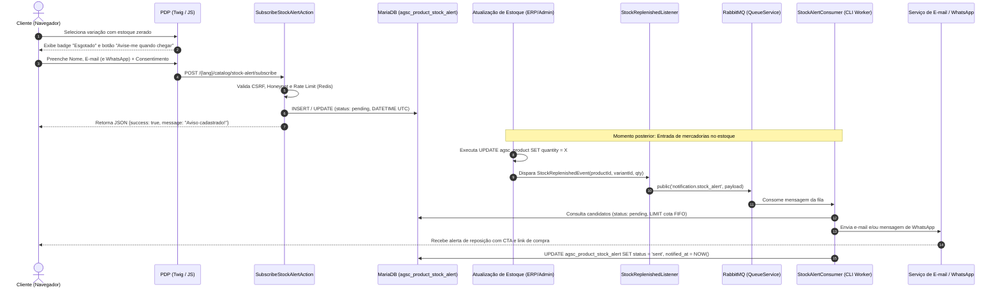

# ADR 008: Arquitetura do Subsistema de Notificação de Reposição de Estoque ("Avise-me quando chegar")

## Status
Aprovado (2026-10-06)

---

## Contexto Geral e Motivadores de Negócio

No comércio eletrônico da **Alpha Engine (AG Sonhos)**, a indisponibilidade imediata de um produto ou de uma variação específica (ex: voltagem 110V/220V em ferramentas, tonalidade de lote de porcelanatos, medidas de colchões ou cores de acabamento) representa um dos maiores pontos de atrito e abandono na jornada de compra do consumidor.

Conforme estabelecido nos casos de uso [UC_CLI_003](file:///var/www/html/agsonhos/docs/business/use-cases/customer/UC_CLI_003_visualizar_detalhes_produto.md) (Fluxo de Exceção FE02) e [UC_CLI_004](file:///var/www/html/agsonhos/docs/business/use-cases/customer/UC_CLI_004_selecionar_variantes_opcoes.md) (Fluxo de Exceção FE01), quando um item atinge saldo zero (`quantity <= 0`), o sistema deve impedir a adição ao carrinho e apresentar a funcionalidade de captura de intenção de compra (*Back-in-stock notification*).

Entretanto, o esboço preliminar desta funcionalidade apresentava deficiências críticas de arquitetura que violavam os padrões do projeto:
1. **Incompatibilidade com a ADR 0005:** Utilizava o tipo `TIMESTAMP`, estritamente proibido na Alpha Engine devido ao problema do ano 2038 e inconsistências de timezone (a [ADR 0005](file:///var/www/html/agsonhos/docs/architecture/adr/0005-use-datetime-over-timestamp.md) padronizou o uso de `DATETIME` UTC).
2. **Desacoplamento e Performance:** Propunha disparos diretos e síncronos no momento da atualização de estoque, o que degrada gravemente rotinas de entrada de notas fiscais, sincronizações via ERP, fechamentos de caixa no PDV físico e retornos de pedidos cancelados.
3. **Ausência de Governança LGPD:** Não previa termo de consentimento explícito, rastreabilidade de IP, política de retenção/expiração ou link direto de cancelamento de inscrição (*opt-out*).
4. **O Efeito "Corrida ao Estoque" (*Stampede Problem*):** Disparar alertas simultaneamente para centenas de inscritos quando chegam poucas unidades físicas gera frustração em massa ("o e-mail chegou agora e já acabou de novo"), sobrecarga transitória no servidor e taxa elevada de chamados no SAC.
5. **Divergência com a Modelagem de Variantes:** Não considerava a estrutura relacional de produtos pais e filhos (`agsc_product.master_id`) nem as opções de compra (`agsc_product_option_value`), além de colidir com o comportamento da view de produto (`ShowProductAction.php`), onde variantes com saldo zero eram simplesmente omitidas.

---

## Decisão Arquitetural

Decide-se pela implementação de um **subsistema resiliente, desacoplado e orientado a eventos (EDA)** para captura de leads e notificação de produtos reabastecidos, integrado ao ecossistema Slim 4, RabbitMQ, MariaDB/MySQL e Twig 3.

A solução estrutura-se nos seguintes pilares fundamentais:

```
+---------------------------------------------------------------------------------------------------+
|                                       FLUXO DE CAPTURA (FRONTEND / HTTP)                          |
|  [Cliente na PDP] ---> [Seletor de Variação Esgotada] ---> [Modal "Avise-me"]                    |
|                                                                    |                              |
|                                            (POST /{lang}/stock-alert/subscribe)                   |
|                                                                    v                              |
|                          [SubscribeStockAlertAction] ---> [Rate Limiting / Honeypot]              |
|                                                                    v                              |
|                          [agsc_product_stock_alert] (Status: pending / DATETIME UTC)              |
+---------------------------------------------------------------------------------------------------+
                                                  |
                                                  | (Reabastecimento físico: ERP / Admin / NF / Devolução)
                                                  v
+---------------------------------------------------------------------------------------------------+
|                                       FLUXO DE NOTIFICAÇÃO ASSÍNCRONA                             |
|  [Atualização de Estoque (quantity > 0)] ---> Dispara [StockReplenishedEvent]                      |
|                                                                    v                              |
|                            [StockReplenishedListener] publica em RabbitMQ                         |
|                                        (Fila: notification.stock_alert)                           |
|                                                                    v                              |
|                                [StockAlertConsumer (Worker CLI em Background)]                    |
|                                                                    v                              |
|                             [Cálculo de Cota / FIFO Anti-Frustração]                              |
|                                                                    v                              |
|                  +-------------------------+-------------------------------+                      |
|                  |                         |                               |                      |
|                  v                         v                               v                      |
|         [Email Transacional]      [WhatsApp / SMS Gateway]      [Atualiza status -> 'sent']       |
+---------------------------------------------------------------------------------------------------+
```

---

### 1. Modelagem Física de Dados (`agsc_product_stock_alert`)

A tabela é modelada no banco relacional seguindo a convenção de nomenclatura da Alpha Engine (`agsc_`), chaves primárias e estrangeiras `BIGINT(20) UNSIGNED`, e estrita conformidade com a [ADR 0005](file:///var/www/html/agsonhos/docs/architecture/adr/0005-use-datetime-over-timestamp.md) (`DATETIME` UTC para todas as colunas temporais).

```sql
CREATE TABLE `agsc_product_stock_alert` (
  `id` BIGINT(20) NOT NULL AUTO_INCREMENT,
  `store_id` BIGINT(20) NOT NULL DEFAULT 1 COMMENT 'ID da loja (Multi-store)',
  `language_id` BIGINT(20) NOT NULL DEFAULT 2 COMMENT 'ID do idioma de exibição',
  `product_id` BIGINT(20) NOT NULL COMMENT 'ID do produto pai ou base',
  `variant_id` BIGINT(20) DEFAULT NULL COMMENT 'ID do produto filho (agsc_product) ou agsc_product_option_value',
  `customer_id` BIGINT(20) DEFAULT NULL COMMENT 'ID do cliente cadastrado (NULL se visitante)',
  `name` VARCHAR(96) NOT NULL COMMENT 'Nome informado pelo cliente',
  `email` VARCHAR(96) NOT NULL COMMENT 'E-mail para disparo da notificação',
  `phone` VARCHAR(32) DEFAULT NULL COMMENT 'Telefone / WhatsApp opcional para disparo móvel',
  `status` ENUM('pending', 'queued', 'sent', 'cancelled', 'expired') NOT NULL DEFAULT 'pending' COMMENT 'Ciclo de vida do alerta',
  `unsubscribe_token` VARCHAR(64) NOT NULL COMMENT 'Hash criptográfico (SHA-256) para cancelamento sem login',
  `ip` VARCHAR(45) NOT NULL COMMENT 'Endereço IP de origem para auditoria e controle de abuso',
  `user_agent` VARCHAR(255) DEFAULT NULL COMMENT 'Navegador/dispositivo do cliente',
  `consent_privacy` TINYINT(1) NOT NULL DEFAULT 1 COMMENT 'Consentimento LGPD para uso do dado neste alerta',
  `consent_marketing` TINYINT(1) NOT NULL DEFAULT 0 COMMENT 'Opt-in opcional para réguas promocionais gerais',
  `notified_at` DATETIME DEFAULT NULL COMMENT 'Data/hora exata do envio da notificação (UTC)',
  `created_at` DATETIME NOT NULL COMMENT 'Data/hora de registro da intenção (UTC - ADR 0005)',
  `updated_at` DATETIME NOT NULL COMMENT 'Data/hora de atualização do registro (UTC - ADR 0005)',
  `expires_at` DATETIME NOT NULL COMMENT 'Data de expiração automática (TTL padrão: 90 dias em UTC)',
  PRIMARY KEY (`id`),
  KEY `idx_stock_lookup` (`store_id`, `product_id`, `variant_id`, `status`),
  KEY `idx_status_expires` (`status`, `expires_at`),
  KEY `idx_email` (`email`),
  KEY `idx_unsubscribe` (`unsubscribe_token`),
  CONSTRAINT `fk_stock_alert_product` FOREIGN KEY (`product_id`) REFERENCES `agsc_product` (`id`) ON DELETE CASCADE
) ENGINE=InnoDB DEFAULT CHARSET=utf8mb4 COLLATE=utf8mb4_unicode_ci ROW_FORMAT=DYNAMIC;
```

#### Regras de Modelagem:
* **Prevenção de Duplicidade:** Se o mesmo e-mail solicitar o mesmo produto/variante enquanto o status for `pending`, o sistema atualiza o registro existente (renovando `expires_at` e `updated_at`) em vez de gerar múltiplos alertas idênticos.
* **Ciclo de Vida do Registro (`status`):**
  * `pending`: Inscrição ativa aguardando entrada de estoque.
  * `queued`: Alerta selecionado e inserido na fila de despacho do RabbitMQ.
  * `sent`: Notificação disparada com sucesso para o canal do cliente.
  * `cancelled`: Usuário clicou no link de opt-out/cancelamento.
  * `expired`: Prazo de validade atingido (sem reabastecimento no período).

---

### 2. Camada Web e Inscrição (Slim 4 & Single Action Controllers)

A captura da inscrição é exposta por uma Action dedicada e minimalista baseada nas interfaces PSR-7/PSR-15:

* **Endpoint:** `POST /{lang}/catalog/stock-alert/subscribe`
* **Classe:** `Alpha\Controller\Actions\Product\SubscribeStockAlertAction`
* **Camada de Proteção e Resiliência:**
  1. **Anti-Spam via Honeypot:** Campo oculto no formulário (`form_check_company`). Se preenchido por robôs, a requisição é descartada silenciosamente com HTTP 200 (técnica de descarte falso positivo).
  2. **Rate Limiting no Redis:** Limite estrito de no máximo 5 requisições de submissão por endereço IP a cada 10 minutos (`stock_alert:ip:{ip}` via `SET NX EX`), prevenindo abusos de preenchimento em massa.
  3. **Auto-preenchimento para Usuário Autenticado:** Se o cliente possuir sessão ativa (`customer->isLogged()`), os campos de nome, e-mail e telefone são preenchidos automaticamente na interface Twig, exigindo apenas um clique de consentimento.
  4. **Geração de Token Criptográfico:** Criação de `unsubscribe_token` único (HMAC SHA-256 gerado a partir do ID do produto, e-mail e app secret), viabilizando o cancelamento com 1 clique diretamente no rodapé da mensagem.

---

### 3. Adaptação da PDP e Seletor de Variantes (Twig 3 / ShowProductAction)

No código legado de [ShowProductAction.php](file:///var/www/html/agsonhos/backend/core/Controller/Actions/Product/ShowProductAction.php#L237-L240), variações com estoque zerado eram suprimidas da listagem (`continue`), impossibilitando a exibição da opção para o cliente. 

#### Decisão de Apresentação:
1. **Preservação de Variantes Esgotadas no Array de Dados:** As variantes sem estoque ativo são mantidas no array `$variants` repassado à view Twig, porém marcadas com a flag `is_out_of_stock = true` e `stock_status_name = 'Esgotado'`.
2. **Comportamento Dinâmico na Interface (PDP):**
   * Se o produto for simples e estiver com `quantity <= 0`: O botão "Adicionar ao Carrinho" é ocultado e substituído pelo botão em destaque `"Avise-me quando chegar"`.
   * Se o produto possuir opções/variantes (voltagem 110V/220V, medidas, acabamento): Ao clicar em uma opção com `is_out_of_stock = true`, o visualizador aplica estilização riscada/desabilitada na opção, altera o CTA de compra instantaneamente para o gatilho de abertura do modal "Avise-me quando chegar" e vincula o `variant_id` correspondente.

---

### 4. Desacoplamento Assíncrono via RabbitMQ (EDA)

O reabastecimento de estoque pode ocorrer a qualquer momento através de:
* Recebimento de notas fiscais de entrada (módulo de compras/estoque);
* Sincronização periódica via API de integração com ERP;
* Cancelamento ou estorno de pedidos no checkout;
* Ajuste manual de inventário por operador do almoxarifado no Admin/PDV.

Para isolar completamente essas operações críticas de escrita e evitar bloqueios na camada de dados, nenhuma notificação é enviada de forma síncrona:

```
[Atualização no BD: quantity > 0]
              |
              v
[Domain Event: StockReplenishedEvent]
              |
              v
[StockReplenishedListener] ---> QueueService::publish('notification.stock_alert', payload)
                                           |
                                           v
                              [Broker RabbitMQ Durável]
                                           |
                                           v
                          [CLI Worker: StockAlertConsumer]
```

#### Payload Publicado no RabbitMQ:
```json
{
  "event": "stock.replenished",
  "store_id": 1,
  "product_id": 1042,
  "variant_id": 308,
  "new_quantity": 10,
  "timestamp": "2026-10-06T14:45:00Z"
}
```

---

### 5. Estratégia de Disparo Escalonado (FIFO Anti-Frustração / Cota)

Para sanar o **Efeito Corrida ao Estoque (*Stampede Problem*)**, o consumer em segundo plano adota uma régua proporcional entre o volume de itens repostos e o volume de alertas disparados:

$$\text{Tamanho do Lote} = \min(\text{Alertas Pendentes}, \text{Estoque Reposto} \times K)$$

Onde $K$ é o **fator de conversão esperado** (padrão $K = 3$, ou seja, 3 notificações para cada 1 unidade física disponível, considerando que nem todos os clientes abrirão o e-mail ou concluirão a compra).

#### Regras do Despacho:
1. **Prioridade Estrita por Ordem de Chegada (FIFO):** Ordenação por `created_at ASC`. Quem se cadastrou primeiro tem prioridade na primeira leva de avisos.
2. **Janela de Carência (*Cooldown Window*):** Os registros notificados passam para `status = 'sent'`. Caso após um período configurável (ex: 6 horas) o estoque ainda permaneça positivo (`quantity > 0`), o job automático seleciona o próximo lote de clientes pendentes.
3. **Alerta de Escassez Transparente no Copy:** O e-mail e a mensagem de WhatsApp informam explicitamente o caráter limitado da reposição ("*Estoque limitado: apenas X unidades disponíveis. Garanta a sua antes que esgote novamente.*").

---

### 6. Conformidade Legal (LGPD) e Governança de Dados

Em alinhamento rigoroso com a [ADR 0007](file:///var/www/html/agsonhos/docs/architecture/adr/0007-audictory.md) (Auditoria e Observabilidade Ativa) e a Lei Federal nº 13.709/2018 (LGPD):

1. **Consentimento Explícito (Opt-In):** O formulário exige aceite inequívoco de que o e-mail e/ou WhatsApp serão utilizados estritamente para comunicar a disponibilidade do produto solicitado. A caixa de aceite para marketing secundário é desmarcada por padrão.
2. **Direito ao Esquecimento e Cancelamento com 1 Clique (Opt-Out):** Todas as comunicações enviadas incluem um link direto de cancelamento:
   `GET /{lang}/catalog/stock-alert/unsubscribe?token={unsubscribe_token}`
   A rota invalida o alerta (`status = 'cancelled'`) sem exigir que o cliente digite senha ou realize login.
3. **Sanitização Ativa em Logs (`Alpha\Support\LgpdSanitizer`):** Todos os logs de depuração, métricas de envio e payloads auditados mascaram e-mails e telefones de clientes (ex: `j***@dominio.com`, `(11) 98***-**21`).
4. **Política de Retenção e Expiração Automática (TTL):** Alertas sem reposição em até 90 dias são marcados como `expired` por uma rotina de cron noturna, preservando a higiene do banco e eliminando contatos obsoletos.

---

### 7. Comunicação Multi-Canal e Copywriting de Alta Conversão

O disparo de mensagens apoia-se em dois canais complementares:

#### Canal 1: E-mail Transacional Responsivo (Twig Template)
* **Assunto:** `🌟 Olha quem voltou! O [Nome do Produto] já está disponível para você!`
* **Pré-cabeçalho:** `Você pediu e nós reservamos o aviso: corra para garantir o seu antes que esgote.`
* **Corpo do E-mail:**
  * Nome do cliente personalizado;
  * Foto de alta qualidade do produto/variante redimensionada via `ImagePresenter`;
  * Preço atualizado formatado na moeda corrente com indicação de parcelamento;
  * Botão de Ação (CTA) direto com parâmetros UTM rastreáveis (`utm_source=stock_alert&utm_medium=email&utm_campaign=back_in_stock`);
  * Link de cancelamento no rodapé (*Unsubscribe*).

#### Canal 2: WhatsApp / SMS Transacional (Opcional se fornecido telefone)
* **Mensagem Curta e Direta:**
  > *"Olá, [Nome]! O produto que você estava esperando no [Nome da Loja] acabou de voltar ao estoque: [Nome do Produto]. Acesse o link oficial para conferir antes que acabe: [URL_Curta] (Para cancelar alertas, responda PARAR)."*

---

## Diagrama de Sequência da Arquitetura



---

## Consequências Arquiteturais

### Positivas (Prós)
* **Aumento Real de Conversão e Retenção:** Resgata clientes altamente qualificados que abandonariam a loja ao encontrar prateleiras virtuais vazias.
* **Inteligência de Compras e Demanda:** A agregação de registros na tabela `agsc_product_stock_alert` com status `pending` fornece um indicador valioso para o time de compras e estoque sobre quais SKUs possuem demanda reprimida.
* **Zero Impacto em Performance Transacional:** Graças ao RabbitMQ (`Alpha\Events\QueueService`), operações pesadas de entrada de estoque no ERP ou PDV não sofrem latência de conexões SMTP externas.
* **Estrita Conformidade de Padrões:** 100% aderente à [ADR 0005](file:///var/www/html/agsonhos/docs/architecture/adr/0005-use-datetime-over-timestamp.md) (uso exclusivo de `DATETIME`), [ADR 0007](file:///var/www/html/agsonhos/docs/architecture/adr/0007-audictory.md) (sanitização LGPD) e ao padrão de Actions do Slim 4.
* **Eliminação de Frustração por Efeito Manada:** O algoritmo de cota e despacho escalonado protege a imagem da marca e otimiza a conversão de cada lote reposto.

### Negativas e Riscos Mitigados (Contras & Mitigações)
* **Complexidade Operacional:** Demanda a manutenção de um worker de fila rodando continuamente (`StockAlertConsumer`).
  * *Mitigação:* Monitoramento via Supervisor/Systemd e mecanismo de fallback resiliente com processamento via rotina de Cron periódica caso a conexão do RabbitMQ falhe temporariamente.
* **Risco de Envio Obsoleto:** O cliente pode já ter comprado o item em um concorrente caso o produto demore meses para voltar ao estoque.
  * *Mitigação:* TTL automático de 90 dias expira a solicitação e o template de comunicação sempre verifica o preço e as condições vigentes antes de formatar o disparo.

---

## Conformidade e Validação

Para assegurar a conformidade contínua com esta ADR:
1. **Testes Unitários e de Integração:**
   * `StockAlertSubscriptionTest`: Validação de preenchimento, rejeição de e-mail inválido, bloqueio por honeypot e rate-limiting no Redis.
   * `StockReplenishedQueueTest`: Verificação da publicação correta do evento no RabbitMQ após atualização de saldo.
   * `StockAlertQuotaCalculationTest`: Verificação da fórmula matemática de cota de notificações por quantidade reposta.
2. **Auditoria de Banco de Dados:**
   * Verificação automatizada via linter de banco garantindo ausência de colunas `TIMESTAMP` na tabela `agsc_product_stock_alert`.
