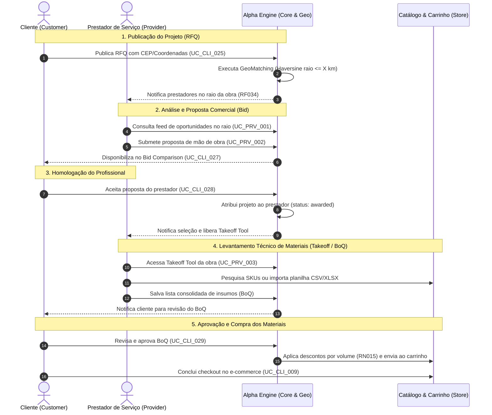

# 👷 Especificação de Casos de Uso: Área do Prestador de Serviço
> **Projeto:** Alpha Engine (Plataforma E-commerce & Hub de Serviços para Construção Civil)  
> **Módulo:** Portal do Prestador de Serviços (*Service Provider Portal & RFQ/BoQ Ecosystem*)  
> **Status:** Homologado / Em Conformidade com RF033 a RF037 e DP-89  
> **Responsáveis:** Equipe de Engenharia de Requisitos & Arquitetura de Software  

---

## 📌 1. Visão Geral & Contexto de Negócio

No ecossistema da **Alpha Engine**, a **Área do Prestador de Serviço** fecha o ciclo comercial de ponta a ponta entre o cliente final (que possui uma demanda de reforma ou construção), os profissionais técnicos autônomos/empreiteiros credenciados e a loja de materiais de construção.

### 🔄 Da Ideia Bruta à Especificação de Engenharia de Software

| Aspecto | Rascunho Inicial (Informal) | Especificação de Engenharia de Requisitos (Padrão de Mercado) |
| :--- | :--- | :--- |
| **Publicação da Obra** | *"Cliente vai colocar o projeto que seseja pedir orçamento"* | O cliente cadastra uma **Solicitação de Cotação de Projeto (RFQ - Request for Quotation)** especificando escopo, fotos, memorial descritivo e localização geográfica precisa por CEP (`UC_CLI_025`). |
| **Distribuição Geográfica** | *"prestadores que atende no raio x da obra, recebem para orçar"* | O motor geoespacial do sistema executa o **matching geodésico (Fórmula de Haversine)** confrontando as coordenadas da obra com o raio de cobertura cadastrado de cada profissional (`service_radius_km`, padrão de 25 km), notificando apenas os prestadores elegíveis (`UC_PRV_001` / RF034). |
| **Orçamento da Mão de Obra** | *"e geram o orçamento com base nisso"* | O profissional analisa as especificações técnicas e submete formalmente uma **Proposta Comercial de Mão de Obra (Bid)** contendo valor do serviço, prazo estimado de execução e escopo detalhado (`UC_PRV_002` / RF035). |
| **Seleção do Profissional** | *"depois da escolha do profissional"* | O cliente utiliza o painel comparativo lado a lado (*Bid Comparison* - `UC_CLI_027`) e homologa a proposta vencedora (`UC_CLI_028`), atribuindo o projeto ao prestador. |
| **Levantamento de Materiais** | *"ele seleciona os materiais necessários para calcular no sistema"* | O prestador contratado acessa a ferramenta técnica de **Material Takeoff (MTO / BoQ Tool)** para estruturar a **Lista Discriminada de Quantitativos de Materiais (Bill of Quantities - BoQ)**, associando insumos aos produtos do catálogo ou importando planilhas, liberando os itens com descontos por volume para aprovação do cliente e envio ao carrinho (`UC_PRV_003` / RF036 / RF037). |

---

## 📊 2. Diagrama de Sequência do Ciclo de Vida da Obra

O diagrama a seguir descreve as interações orquestradas entre os atores e a arquitetura do sistema:



---

## 🏗️ 3. Arquitetura Modular dos Casos de Uso do Prestador

Para atender aos princípios da engenharia de software e granularidade funcional, a jornada do prestador é decomposta em **três casos de uso formais**:

1. [**UC_PRV_001**](#uc_prv_001---consultar-oportunidades-de-obras-no-raio-de-atendimento): Consultar Oportunidades de Obras no Raio de Atendimento (`/prestador/oportunidades`).
2. [**UC_PRV_002**](#uc_prv_002---elaborar-e-submeter-proposta-comercial-de-mão-de-obra): Elaborar e Submeter Proposta Comercial de Mão de Obra (`/prestador/projetos/{rfq_id}/proposta`).
3. [**UC_PRV_003**](#uc_prv_003---realizar-levantamento-técnico-de-materiais-material-takeoff--boq): Realizar Levantamento Técnico de Materiais (*Material Takeoff / BoQ Tool*) (`/prestador/projetos/{rfq_id}/takeoff`).

---

# UC_PRV_001 - Consultar Oportunidades de Obras no Raio de Atendimento

## 📋 Informações do Caso de Uso

| Atributo | Detalhe |
| :--- | :--- |
| **Identificador** | `UC_PRV_001` |
| **Nome** | Consultar Oportunidades de Obras no Raio de Atendimento |
| **Módulo** | Portal do Prestador - Oportunidades & Matching Geográfico |
| **Atores Primários** | Prestador de Serviços Autenticado (*Service Provider*) |
| **Atores Secundários** | Sistema Alpha Engine (Motor Geoespacial / Haversine) |
| **Tipo** | Condução / Descoberta de Oportunidades |
| **Frequência de Uso** | Alta (diária) |
| **Rastreabilidade** | **RF:** [RF033](/docs/requirements/functional/products_quotation.yaml) (RFQ de projetos), [RF034](/docs/requirements/functional/products_quotation.yaml) (Matching por raio geográfico)<br>**RN:** Regra de Raio de Cobertura ($X$ km, padrão 25 km), Fallback por Cidade/Estado<br>**RNF:** [RNF002](/docs/requirements/non_functional/non_functional_requirements.yaml) (Performance de busca geoespacial < 500ms) |

---

### 1. 🎯 Descrição Sumária
Permite ao prestador de serviços credenciado acessar o painel de oportunidades na rota `/prestador/oportunidades`, visualizando todas as solicitações de orçamento de projetos (RFQs) ativas cujos locais de execução estejam situados dentro do seu raio de atendimento geográfico configurado (calculado via fórmula de Haversine ou fallback municipal). O prestador pode filtrar as obras por categoria, raio de distância e prazo pretendido.

---

### 2. ⚡ Pré-Condições
1. Prestador cadastrado e autenticado no sistema com perfil ativo em `agsc_service_provider_profile`.
2. Perfil do prestador deve conter coordenadas geográficas válidas (latitude e longitude) ou CEP de base com raio de cobertura definido (`service_radius_km > 0`).
3. Existência de projetos RFQ cadastrados com status `'open'` por clientes na plataforma.

---

### 3. ✅ Pós-Condições
- O prestador visualiza a lista filtrada de projetos elegíveis, com distância estimada em km até o canteiro de obras, escopo sumário, data limite de proposta e categoria.

---

### 4. 🚀 Gatilho (Trigger)
O profissional clica no menu "Oportunidades de Serviços" no Portal do Prestador ou acessa `/prestador/oportunidades`.

---

### 5. 🔄 Fluxo Principal (Caminho Feliz)

1. **Ator:** Acessa `/prestador/oportunidades`.
2. **Sistema:** Recupera as coordenadas (latitude e longitude) e o raio configurado (`service_radius_km`, ex: 25 km) do perfil do prestador (`agsc_service_provider_profile`).
3. **Sistema:** Executa a consulta geoespacial no banco de dados (`GeoMatchingService`), calculando a distância esférica ortodrômica pela **fórmula de Haversine**:
   $$d = 2r \arcsin\left(\sqrt{\sin^2\left(\frac{\Delta \phi}{2}\right) + \cos(\phi_1)\cos(\phi_2)\sin^2\left(\frac{\Delta \lambda}{2}\right)}\right)$$
4. **Sistema:** Filtra apenas as RFQs abertas (`status = 'open'`) cuja distância $d \le \text{service\_radius\_km}$ e que ainda não atingiram o teto de 10 propostas.
5. **Sistema:** Renderiza o feed de oportunidades ordenado pela proximidade e data de publicação, exibindo:
   - Título e Categoria da Obra (ex: *"Reforma de Banheiro e Troca de Revestimento - 12m²"*);
   - Distância calculada em km (ex: *"A 6,4 km da sua base"*);
   - Bairro, Cidade e UF da obra (endereço completo e dados do cliente são omitidos por privacidade);
   - Expectativa de prazo de execução e data limite para envio da proposta;
   - Indicador de quantas propostas já foram submetidas por concorrentes.
6. **Ator:** Analisa os detalhes sumários e clica em uma oportunidade para preparar o orçamento (`UC_PRV_002`).

---

### 6. 🔀 Fluxos Alternativos

- **FA01 - Filtragem por Categoria Técnica:**
  1. No passo 5, o prestador aplica o filtro para exibir apenas projetos de sua especialidade (ex: "Elétrica & Cabeamento" ou "Pisos & Porcelanatos").
  2. O sistema reaplica o filtro e atualiza a listagem sem recarregar a página (via AJAX).
- **FA02 - Expansão Provisória do Raio de Busca:**
  1. No passo 5, o prestador utiliza o slider visual para simular oportunidades em até 50 km.
  2. O sistema recalcula as distâncias e exibe as obras disponíveis na nova faixa.

---

### 7. ⚠️ Fluxos de Exceção

- **FE01 - Prestador sem Coordenadas Geográficas Cadastradas:**
  1. No passo 2, o sistema detecta ausência de latitude/longitude no perfil do prestador.
  2. O sistema ativa o mecanismo de fallback por Cidade e Estado (`address_city` e `address_state`).
  3. O sistema exibe um aviso orientando a atualização do CEP base: *"Para calcularmos a distância exata em km até cada obra, complete seu endereço completo no perfil."*
- **FE02 - Nenhuma Obra Aberta no Raio do Prestador:**
  1. No passo 4, nenhuma RFQ aberta atende aos critérios geográficos.
  2. O sistema exibe tela amigável: *"No momento não há novas solicitações de obra no seu raio de [X] km. Você receberá um e-mail/notificação assim que uma nova oportunidade for cadastrada na sua região."*

---

# UC_PRV_002 - Elaborar e Submeter Proposta Comercial de Mão de Obra

## 📋 Informações do Caso de Uso

| Atributo | Detalhe |
| :--- | :--- |
| **Identificador** | `UC_PRV_002` |
| **Nome** | Elaborar e Submeter Proposta Comercial de Mão de Obra (*Bid Submission*) |
| **Módulo** | Portal do Prestador - Cotações & Propostas Comerciais |
| **Atores Primários** | Prestador de Serviços Autenticado (*Service Provider*) |
| **Atores Secundários** | Cliente Solicitante (*Customer*), Sistema Alpha Engine |
| **Tipo** | Condução / Negociação & Submissão de Propostas |
| **Frequência de Uso** | Média a Alta |
| **Rastreabilidade** | **RF:** [RF035](/docs/requirements/functional/products_quotation.yaml) (Submissão e comparação de propostas - Bid Comparison)<br>**RN:** Máximo de 10 propostas por projeto, Validade da proposta (15 dias)<br>**RNF:** [RNF003](/docs/requirements/non_functional/non_functional_requirements.yaml) (Auditoria e integridade de propostas contratuais) |

---

### 1. 🎯 Descrição Sumária
Permite ao prestador examinar minuciosamente o escopo descritivo e as especificações técnicas de uma obra selecionada e enviar sua proposta comercial de prestação de serviços na rota `/prestador/projetos/{rfq_id}/proposta`, informando o valor da mão de obra, prazo estimado em dias, metodologia de execução e notas técnicas explicativas.

---

### 2. ⚡ Pré-Condições
1. O prestador deve estar qualificado dentro do raio geográfico do projeto (`UC_PRV_001`).
2. O projeto RFQ deve estar com status `'open'`.
3. O projeto não pode ter ultrapassado a cota de 10 propostas concorrentes.
4. O prestador não pode ter submetido proposta anterior ainda ativa para a mesma RFQ.

---

### 3. ✅ Pós-Condições
- Registro da proposta gravado na tabela `agsc_project_bid` com status `'submitted'`.
- Notificação instantânea despachada ao cliente informando o recebimento de uma nova proposta.
- Disponibilização dos dados da proposta no painel analítico de comparação do cliente (`UC_CLI_027`).

---

### 4. 🚀 Gatilho (Trigger)
O prestador clica em "Submeter Proposta / Orçar Obra" no card do projeto do feed de oportunidades.

---

### 5. 🔄 Fluxo Principal (Caminho Feliz)

1. **Ator:** Clica em "Submeter Proposta" para a RFQ selecionada.
2. **Sistema:** Carrega o formulário de proposta em `/prestador/projetos/{rfq_id}/proposta`, apresentando o resumo do projeto:
   - Descrição detalhada do serviço fornecida pelo cliente;
   - Fotos/plantas anexas enviadas na publicação;
   - Prazo pretendido de entrega informado pelo cliente.
3. **Ator:** Preenche os campos da proposta comercial:
   - **Valor da Mão de Obra (R$)** (`labor_price`);
   - **Prazo Estimado de Execução (dias)** (`estimated_duration_days`);
   - **Memorial Descritivo / Observações da Proposta** (`proposal_notes`): detalhes do método executivo, etapas, equipamentos inclusos e condições.
4. **Ator:** Clica em "Enviar Proposta Comercial".
5. **Sistema:** Valida as regras de entrada (valor monetário positivo, prazo maior que zero, texto do memorial com requisitos mínimos).
6. **Sistema:** Persiste a proposta na tabela `agsc_project_bid` com:
   - `rfq_id` = ID do projeto;
   - `provider_id` = ID do perfil do prestador autenticado;
   - `status` = `'submitted'`;
   - Timestamp de envio (`date_added`).
7. **Sistema:** Dispara evento `ProjectBidSubmittedEvent`, notificando o cliente solicitante por e-mail e push notification.
8. **Sistema:** Apresenta mensagem de sucesso: *"Sua proposta de R$ [Valor] foi enviada com sucesso! O cliente foi notificado e você será avisado assim que sua oferta for analisada."*

---

### 6. 🔀 Fluxos Alternativos

- **FA01 - Edição de Proposta Aberta:**
  1. Antes do cliente selecionar um profissional, o prestador decide revisar o valor ou o prazo de sua proposta enviada.
  2. O prestador acessa a proposta, altera as condições e salva a atualização.
  3. O sistema atualiza o registro na tabela `agsc_project_bid` e notifica o cliente da revisão.

---

### 7. ⚠️ Fluxos de Exceção

- **FE01 - Limite de Propostas Atingido Concorrentemente:**
  1. Entre o carregamento da tela e o clique no botão enviar, outro prestador enviou a 10ª proposta do projeto.
  2. O sistema bloqueia a gravação e alerta: *"Esta solicitação de orçamento já atingiu o limite máximo de 10 propostas concorrentes e não está mais recebendo novas ofertas."*
- **FE02 - Projeto Cancelado ou Já Homologado pelo Cliente:**
  1. O cliente encerrou ou contratou outro profissional antes do envio da proposta.
  2. O sistema bloqueia a transação e informa: *"Este projeto já foi homologado ou cancelado pelo cliente."*

---

# UC_PRV_003 - Realizar Levantamento Técnico de Materiais (Material Takeoff & BoQ)

## 📋 Informações do Caso de Uso

| Atributo | Detalhe |
| :--- | :--- |
| **Identificador** | `UC_PRV_003` |
| **Nome** | Realizar Levantamento Técnico de Materiais (*Material Takeoff / BoQ Tool*) |
| **Módulo** | Portal do Prestador - Orçamentação Técnica de Insumos (*Takeoff & BoQ*) |
| **Atores Primários** | Prestador de Serviços Selecionado (*Awarded Service Provider*) |
| **Atores Secundários** | Sistema Alpha Engine (Catálogo de Produtos, Motor de Importação BoQ) |
| **Tipo** | Condução / Orçamentação Técnica & Especificação de Engenharia |
| **Frequência de Uso** | Média |
| **Rastreabilidade** | **RF:** [RF036](/docs/requirements/functional/products_quotation.yaml) (Levantamento técnico de materiais - MTO / BoQ), [RF037](/docs/requirements/functional/products_quotation.yaml) (Conversão em cotação e-commerce "Add to Quote")<br>**RN:** [RN001](/docs/requirements/business_rules/business_rules.yaml) (Unidades fracionadas m²/cx), [RN003](/docs/requirements/business_rules/business_rules.yaml) (Especificações obrigatórias), [RN015](/docs/requirements/business_rules/business_rules.yaml) (Desconto por volume no BoQ), [RN017](/docs/requirements/business_rules/business_rules.yaml) (Tabela atacado B2B)<br>**RNF:** [RNF001](/docs/requirements/non_functional/non_functional_requirements.yaml) (Usabilidade da Takeoff Tool) |

---

### 1. 🎯 Descrição Sumária
Permite ao profissional técnico homologado e escolhido pelo cliente (`UC_CLI_028`) acessar a ferramenta de estimativa técnica (**Takeoff Tool**) na rota `/prestador/projetos/{rfq_id}/takeoff` para criar e gerenciar a lista quantitativa completa de insumos e materiais de construção (**Bill of Quantities - BoQ**). O profissional pesquisa itens do catálogo da Alpha Engine em tempo real (ou importa planilha CSV/XLSX), especifica quantidades com margem de segurança técnica, e submete a lista consolidada para que o cliente aprove e compre diretamente no e-commerce com descontos por volume.

---

### 2. ⚡ Pré-Condições
1. O cliente deve ter homologado e aceito a proposta comercial de mão de obra deste prestador (`UC_CLI_028`), definindo `agsc_project_rfq.selected_provider_id` com o ID do prestador e a proposta como `'accepted'`.
2. O prestador deve estar devidamente autenticado na sessão.
3. Catálogo de produtos da Alpha Engine disponível para consulta de preços e SKUs.

---

### 3. ✅ Pós-Condições
- Cabeçalho do BoQ criado ou atualizado na tabela `agsc_project_boq`.
- Itens discriminados vinculados a SKUs do catálogo persistidos na tabela `agsc_project_boq_item`.
- Valor total orçado de materiais recalculado automaticamente (`total_estimated_amount`).
- Status do projeto atualizado para `'boq_ready'`, notificando o cliente para aprovação e transferência dos itens para o carrinho (`UC_CLI_029`).

---

### 4. 🚀 Gatilho (Trigger)
O prestador clica em "Montar Lista de Materiais (Takeoff)" na notificação de contratação ou no painel de projetos em andamento.

---

### 5. 🔄 Fluxo Principal (Caminho Feliz)

1. **Ator:** Acessa a rota `/prestador/projetos/{rfq_id}/takeoff`.
2. **Sistema:** Verifica a autorização: valida se `rfq.selected_provider_id == current_provider_id` e se a proposta vinculada está aceita.
3. **Sistema:** Renderiza a interface da ferramenta **Takeoff Tool**:
   - Cabeçalho com dados da obra e cliente contratante;
   - Tabela de Lista de Materiais (BoQ) editável em tempo real;
   - Barra de busca inteligente com autocomplete integrado ao catálogo de produtos;
   - Seletor de importação em lote de planilha (CSV/TSV/XLSX);
   - Painel resumo de custos parciais e cálculo preliminar de economia por volume (RN015).
4. **Ator:** Digita na busca o nome ou SKU de um insumo (ex: *"Cimento CP II-E-32 50kg Votoran"* ou *"Porcelanato Munari 60x60"*).
5. **Sistema:** Consulta via AJAX (`SearchCatalogItemsAction`) e retorna as opções do catálogo com foto miniatura, unidade de medida (saco, caixa, m², barra) e preço de referência.
6. **Ator:** Seleciona o produto, define a quantidade técnica necessária (ex: 45 sacos) e insere uma observação técnica opcional (ex: *"Considerada margem de 10% para quebra no corte"*).
7. **Sistema:** Adiciona a linha na tabela BoQ, aplica conversão de unidade se necessário (RN001) e recalcula o subtotal monetário.
8. **Ator:** Repete o processo para os demais insumos da obra (areia, brita, argamassa AC-III, rejunte, espaçadores).
9. **Ator:** Revisa os itens e clica em "Finalizar e Enviar Lista de Materiais ao Cliente".
10. **Sistema:** Salva os itens na tabela `agsc_project_boq_item`, consolida o valor total em `agsc_project_boq.total_estimated_amount` e altera o status para `'submitted'`.
11. **Sistema:** Envia notificação por e-mail e push ao cliente: *"O prestador [Nome] finalizou a lista de materiais do seu projeto. Clique para revisar e adicionar tudo ao carrinho com desconto."*
12. **Sistema:** Redireciona o prestador com mensagem: *"Lista de materiais (BoQ) enviada ao cliente com sucesso!"*

---

### 6. 🔀 Fluxos Alternativos

- **FA01 - Importação em Lote via Planilha Excel/CSV (RF036):**
  1. No passo 4, o prestador prefere não buscar item por item e clica em "Importar Planilha de Materiais (.csv, .xlsx)".
  2. O prestador anexa a planilha de levantamento orçamentário.
  3. O serviço `BoqSpreadsheetImportService` processa o arquivo:
     - Detecta delimitadores e encoding automaticamente;
     - Mapeia as colunas (`SKU/Código`, `Item`, `Unidade`, `Quantidade`, `Preço Unitário`);
     - Associa automaticamente os SKUs correspondentes do catálogo.
  4. O sistema popula a grade da Takeoff Tool instantaneamente com todos os itens importados para conferência visual do prestador.
  5. O fluxo segue para o passo 9.
- **FA02 - Adição de Insumo Especial Não Encontrado no Catálogo:**
  1. O prestador necessita de um item customizado/sob medida não comercializado diretamente na loja online.
  2. O prestador seleciona a opção "Adicionar Insumo Avulso/Genérico", preenchendo descrição, quantidade e unidade sem vincular `product_id`.
  3. O sistema inclui o item como observação de compra externa ou para cotação especial com a equipe comercial.

---

### 7. ⚠️ Fluxos de Exceção

- **FE01 - Tentativa de Acesso por Prestador Não Homologado:**
  1. No passo 2, o usuário tenta acessar a rota de Takeoff de um projeto no qual não foi o prestador selecionado pelo cliente.
  2. O sistema bloqueia o acesso com código HTTP 403 (Forbidden) e redireciona com mensagem: *"Acesso não autorizado. A ferramenta de levantamento de materiais só é liberada para o profissional contratado pelo cliente."*
- **FE02 - Planilha Anexa Corrompida ou com Estrutura Inválida:**
  1. No fluxo FA01, o prestador faz upload de um arquivo com extensões não permitidas ou colunas faltando.
  2. O sistema rejeita o arquivo e apresenta erro: *"Não foi possível ler a planilha. Certifique-se de utilizar colunas com Nome do Item, Quantidade e Unidade. Baixe nosso modelo de exemplo em CSV."*

---

## 📜 4. Regras de Negócio e Políticas Aplicadas

| Código | Regra de Negócio | Impacto na Área do Prestador |
| :--- | :--- | :--- |
| **RN001** | **Venda Fracionada e Conversão de Unidades** | Ao orçar revestimentos em m², o sistema calcula o equivalente em caixas fechadas (`Math.ceil`) para garantir integridade na compra. |
| **RN003** | **Especificações Técnicas por Categoria** | Insumos estruturais (cimento, ferro, argamassa) exibem normas técnicas (ABNT) para auxiliar a especificação correta pelo profissional. |
| **RN005** | **Validação de Estoque Físico** | Na Takeoff Tool, o prestador recebe indicação visual do nível de estoque físico da loja para evitar propor materiais em ruptura. |
| **RN015** | **Desconto Progressivo por Volume (BoQ)** | O sistema aplica automaticamente faixas de economia progressiva conforme a quantidade agregada de insumos no BoQ (10+ un: 5%; 50+ un: 10%; 100+ un: 15%; 250+ un: 20%). |
| **RN017** | **Condições Comerciais e Preço de Atacado** | Se o projeto for vinculado a cliente PJ (Construtora), o BoQ reflete as tabelas corporativas B2B acordadas. |
| **RN-GEO-01** | **Matching Geoespacial Estrito (Raio $X$ km)** | Somente prestadores com distância Haversine menor ou igual ao raio cadastrado visualizam e orçam o projeto, garantindo viabilidade logística. |
| **RN-BID-01** | **Limite de Propostas Concorrentes** | Cada projeto aceita no máximo 10 propostas comerciais de prestadores para evitar saturação e garantir agilidade na comparação do cliente. |

---

## 🖥️ 5. Dicionário de Dados, Interfaces e Integração

### Rotas e Controladores no Backend
- `GET /{lang}/prestador/oportunidades` ➔ `ListOpportunitiesAction`
- `GET|POST /{lang}/prestador/projetos/{rfq_id}/proposta` ➔ `SubmitBidAction`
- `GET|POST /{lang}/prestador/projetos/{rfq_id}/takeoff` ➔ `MaterialTakeoffAction`
- `GET /{lang}/api/catalog/search` ➔ `SearchCatalogItemsAction`

### Tabelas de Banco de Dados Afetadas
- `agsc_service_provider_profile`: Cadastro de perfil, especialidades, raio de cobertura em km (`service_radius_km`), coordenadas (`latitude`, `longitude`) e avaliação média.
- `agsc_project_rfq`: Solicitações de orçamento publicadas pelo cliente com dados de localização, prazos e status.
- `agsc_project_bid`: Propostas comerciais de mão de obra (`labor_price`, `estimated_duration_days`, `proposal_notes`, `status`).
- `agsc_project_boq`: Cabeçalho da lista técnica de materiais gerada na Takeoff Tool vinculada ao projeto.
- `agsc_project_boq_item`: Itens quantitativos (`product_id`, `item_name`, `unit`, `quantity`, `unit_price`, `total_price`).

---

## 🔗 6. Matriz de Integração com a Área do Cliente (Rastreabilidade Cruzada)

```
[Cliente: UC_CLI_025] Cria RFQ do Projeto 
        │
        ▼ (Matching Geoespacial Haversine - RF034)
[Prestador: UC_PRV_001] Visualiza Oportunidade no Raio X km
        │
        ▼ (Elaboração do Orçamento de Mão de Obra)
[Prestador: UC_PRV_002] Submete Proposta Comercial (Bid)
        │
        ▼ (Análise Comparativa - RF035)
[Cliente: UC_CLI_027] Compara Propostas lado a lado
        │
        ▼ (Homologação & Contratação)
[Cliente: UC_CLI_028] Aceita Proposta do Prestador
        │
        ▼ (Liberação de Ferramenta Técnica)
[Prestador: UC_PRV_003] Executa Material Takeoff e monta BoQ
        │
        ▼ (Revisão da Lista de Insumos - RF036 / RF037)
[Cliente: UC_CLI_029] Aprova BoQ e Envia ao Carrinho de Compras
        │
        ▼ (Fechamento Comercial)
[Cliente: UC_CLI_009] Conclui Checkout no E-commerce
```
